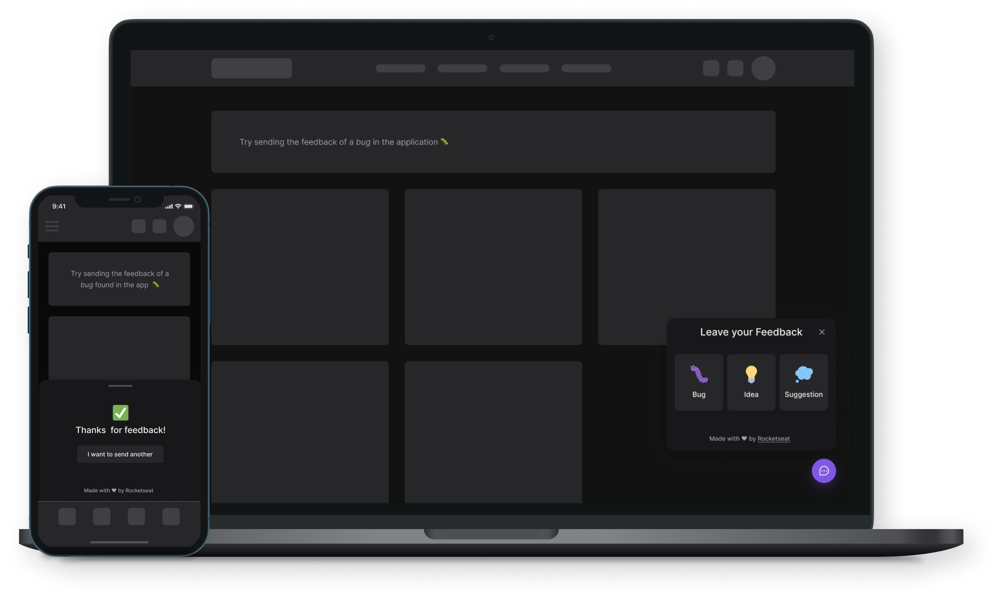

<h1 align="center">
  Feedback Widget - FeedGet
</h1>

<p align="center">
  <a href="#project">Project</a> •
  <a href="#layout">Layout</a> •
  <a href="#technologies">Technologies</a> •
  <a href="#getting-started">Getting started</a> •
  <a href="#roadmap">Roadmap</a> •
  <a href="#license">License</a>
</p>

<p align="center">
  
</p>

## Project

Web and App Mobile version of a component responsible for sending feedbacks of an application. The feedbacks are composed of a message and a optional screenshot, which can be taken automatically. These are saved on a database and also sent via email.

This project was developed as a study case on [Rocketseat](https://rocketseat.com.br)'s NLW #8 event.

## Layout

The project layout is available at the link below:

- [Feedback Widget - Figma](https://www.figma.com/community/file/1102912516166573468)

Setup a [Figma](http://figma.com/) account to access and duplicate it, if you wish to.

## Technologies

- [ReactJS](https://reactjs.org/)
- [TypeScript](https://www.typescriptlang.org/)
- [TailwindCSS](https://tailwindcss.com/)
- [Vitejs](https://vitejs.dev/)
- [Express](https://expressjs.com/)
- [Prisma](https://www.prisma.io/)
- [React Native](https://reactnative.dev/)
- [Expo](https://expo.io/)

## Getting started

### Requirements

- [Node.js](https://nodejs.org/en/)
- [Yarn](https://classic.yarnpkg.com/) or [npm](https://www.npmjs.com/package/npm)
- [Docker](https://docker.com)
- [Expo CLI](https://docs.expo.dev/workflow/expo-cli)

**Clone the project and access the folder**

```bash
git clone https://github.com/scalfs/feedback-widget.git && cd feedback-widget
```

**Follow the steps below**

### Server

```bash
# From the project root folder access the 'server' folder
$ cd server

# Install the dependencies
$ npm install

# Make a copy of '.env.example' to '.env'
# and set with YOUR environment variables.
$ cp .env.example .env

# Start a Postgres instance on Docker
$ docker run --name feedget-postgres \
    -e POSTGRES_USER=docker -e POSTGRES_PASSWORD=docker123 \
    -e POSTGRES_DB=feedget -p 5432:5432 -d postgres

# Run the migrations
$ npx prisma migrate dev

# Start the server
$ npm run dev
```

### Web

**Make sure to have the server running**

```bash
# From the project root folder access the 'web' folder
$ cd web

# Install the dependencies
$ npm install

# Make a copy of '.env.local.example' to '.env.local'
$ cp .env.local.example .env.local

# Start the application
$ npm run dev
```

### Mobile

**Make sure to have the server running**

```bash
# From the project root folder access the 'mobile' folder
$ cd mobile

# Install the dependencies
$ npm install

# Start the bundle
$ expo start

# Connect your phone or start a emulator
```

## Roadmap

- [x] Light/Dark modes
- [] Build a Dashboard, for visualizing all received feedbacks

## License

This project is distributed under the MIT License. See the [LICENSE](LICENSE.md) file for more details.
